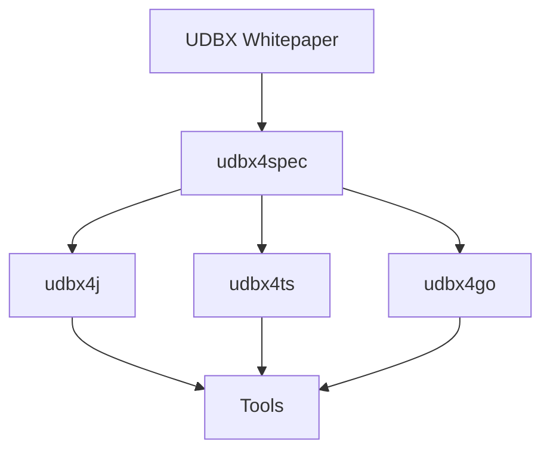

# AGENTS.md

本文件是 `udbx4x` 工作区的总入口文档，用于指导人类维护者和自动化编码代理理解项目定位、工作原则、技术架构、目录结构、基础开发约定和文档维护规约。

## 交流语言约定

本项目的协作交流语言始终以简体中文为主。

以下情况必须使用简体中文：

- 与维护者、贡献者、自动化智能体之间的日常沟通。
- 根目录长期文档，如 `README.md`、`ROADMAP.md`、`GOVERNANCE.md`、`CONTRIBUTING.md`、`RELEASE.md`、`SECURITY.md`、`AGENTS.md`。
- 项目定位、工作原则、治理规则、发布流程、贡献流程、安全策略、路线图、实施计划、故障排查。
- 对需求、问题、风险、根因、方案、权衡、验收标准的解释。
- 面向中文开发者的示例说明和操作指南。

以下情况可以使用英文或其他语言：

- 代码、API 名称、类型名、字段名、包名、命令、配置项、错误码、协议字段。
- Git commit message、Git tag、npm/Maven/Go module 元数据等生态惯用文本。
- 与上游标准、第三方库、官方 API 保持一致的专有名词。
- 面向国际开源社区发布的英文 README、英文 API 文档、英文 release notes。
- 引用外部英文资料时的原文标题、链接和必要短语。

当中文说明和英文术语同时出现时，以中文解释为准；英文仅作为生态兼容、检索和准确命名用途。新增长期文档时，默认使用简体中文；确需英文版时，应作为并列翻译文档或独立英文入口维护。

## 项目定位

`udbx4x` 是围绕 UDBX（Universal Spatial Database Extension）开放格式建设的开源 GIS SDK 与工具生态工作区。

短期目标是提供成熟、稳定、高质量的开源 SDK：

- `udbx4j` 发布到 Maven Central，服务 Java / JVM GIS 开发者。
- `udbx4ts` 发布到 npm，服务 Web、Node.js、Electron 和前端 GIS 开发者。
- `udbx4go` 发布到 pkg.go.dev，服务 Go 生态和跨平台工具开发。

中长期目标是在开源 SDK 之上建设完整工具生态，包括但不限于：

- UDBX 文件查看器。
- 命令行检查、查询、转换工具。
- 合规验证器。
- 跨语言读写一致性测试工具。
- 面向开发者和售前场景的智能辅助工具。

项目的最高格式依据是 UDBX 白皮书，同时以真实 `.udbx` 样本文件作为兼容性证据。所有语言实现必须围绕统一规范演进，避免各自分叉。

## 工作原则

### 概念统一

- 所有实现必须使用统一概念模型、统一术语和统一 API 语义。
- `DatasetKind`、`FieldType`、`Feature`、`Geometry`、`DataSource`、`Dataset` 等核心概念必须以 `udbx4spec` 为准。
- 同一概念不得在不同语言、不同文档或不同模块中使用含义不同的名称。
- 维护术语表，新增概念前必须先确认是否已有等价概念。

### 遵从规范

- 白皮书是格式事实的最高依据。
- `udbx4spec` 是跨语言 API、数据模型和合规测试的工程化规范入口。
- 遇到概念、术语、API 或格式解释冲突时，先修订文档和规范，再实现代码。
- 任何结构性变更必须同步更新规范、测试、文档和相关语言实现。

### 文档优先

- 重要设计先写文档，再写代码。
- 新增概念先进入概念文档或术语表。
- 新增规则先进入规范文档。
- 新增流程先进入操作指南。
- 文档不是代码之后的补充，而是设计和协作的入口。

### 架构优雅

- 架构应反映问题本质，而不是堆叠临时方案。
- 模块边界要清晰，依赖方向要稳定。
- SDK 负责格式读写和核心能力，工具层必须依赖 SDK，不得复制底层格式解析逻辑。
- 共享规范放在 `udbx4spec`，语言特定实现留在各自子项目。

### 代码简洁

- 优先选择直接、清楚、可验证的实现。
- 保持文件、函数、类型职责单一。
- 避免过早抽象、过度封装和无意义的兼容层。
- 代码应服务真实需求，不为假想场景增加复杂度。

### 不保留历史包袱

- 不兼容旧实现。
- 不保留兼容分支。
- 不采用打补丁兜底和绕路实现。
- 发现旧实现与规范冲突时，修正旧实现；不要在新实现里迁就错误概念。
- 破坏性变更必须通过版本、迁移说明和发布说明清楚表达。

### 回归本质

- 从原始需求和问题本质出发，不被已有代码形状牵着走。
- 修复问题时必须挖掘根因，彻底解决问题。
- 不接受只消除表象的临时修补。
- 当需求不清晰时，优先澄清目标、输入、输出、约束和验收标准。

### 避免重复

- 不重复定义规范。
- 不重复实现格式解析。
- 不重复维护概念映射表。
- 不在多个地方硬编码同一事实。
- 常量、映射、夹具和测试期望应尽量来自规范或共享测试资产。

### 拒绝硬编码

- 除非白皮书或规范明确规定，不得把样本文件里的偶然值写死为规则。
- 对格式魔数、系统表字段、枚举值、二进制布局等必须注明来源。
- 样本兼容逻辑必须可解释、可测试、可扩展。

### 效率优先

- 优先推进能提升规范完整性、SDK 稳定性和跨语言一致性的工作。
- 小步提交，频繁验证，避免长期不可运行的分支。
- 本地构建和测试必须可重复。
- 遇到阻塞要及时暴露事实、风险和可选方案。

### 充分沟通

- 涉及格式语义、公开 API、发布流程和跨语言一致性的变更必须说明动机、影响和验证方式。
- 设计分歧先回到规范、样本和用户场景，不做个人偏好之争。
- 对不确定结论必须标注假设，不把推断写成事实。

## 技术架构

### 总体分层

```text
UDBX 白皮书 / 真实 UDBX 样本
  |
  v
udbx4spec：跨语言规范、类型定义、合规夹具、测试矩阵
  |
  +-- udbx4j：Java SDK，Maven 发布
  +-- udbx4ts：TypeScript SDK，npm 发布
  +-- udbx4go：Go SDK，pkg.go.dev 发布
        |
        v
工具生态：viewer、CLI、copilot、validator、converter
```

### 核心格式模型

- UDBX 文件是基于 SQLite 的空间数据库文件。
- 系统表包括 `SmRegister`、`SmFieldInfo`、`geometry_columns`、`SmDataSourceInfo`。
- 空间几何主要使用 GAIA Geometry 二进制编码。
- CAD 使用 SuperMap 自定义 CAD 二进制格式。
- 字节序统一为 Little-Endian。
- 跨语言几何交换模型使用 GeoJSON-like 结构，并允许扩展 `srid`、`hasZ`、`bbox`。

### 规范工程：`udbx4spec`

`udbx4spec` 是跨语言统一的核心，应包含：

- 命名规范。
- 几何模型。
- 数据集类型分类。
- 字段类型分类。
- 错误分类。
- 语言映射。
- JSON Schema。
- TypeScript 参考定义。
- Java 参考接口。
- 合规测试夹具。
- 跨语言读写一致性矩阵。

任何公开 API、核心概念、格式解释或合规规则的变更，应先进入 `udbx4spec`。

### Java SDK：`udbx4j`

- 技术栈：Java 17、Maven、SQLite JDBC、JTS、JUnit。
- 发布目标：Maven Central。
- 重点：稳定 API、服务端集成、JVM GIS 场景、性能和资源管理。
- Java 可使用 JTS 作为内部几何库，但对外交换语义必须与 GeoJSON-like 模型一致。

### TypeScript SDK：`udbx4ts`

- 技术栈：TypeScript、npm、Vitest、Playwright、SQLite WASM、better-sqlite3、JSTS。
- 发布目标：npm。
- 重点：浏览器、Node.js、Electron、Web GIS 和前端工具生态。
- `src/core/` 必须保持平台无关，不得依赖 DOM、Worker、Electron 或具体 SQLite 驱动。
- 浏览器运行时数据库操作必须在 Worker 内完成。

### Go SDK：`udbx4go`

- 技术栈：Go、go-sqlite3、testify。
- 发布目标：pkg.go.dev。
- 重点：跨平台命令行工具、轻量服务、桌面工具后端。
- Go 实现必须补齐与 `udbx4spec` 的一致性，当前优先缺口是 Text 数据集支持。

### 工具生态

- `udbx-copilot` 是基于 `udbx4ts` 的本地优先 CLI 工具。
- `udbx4go` viewer 是基于 Go SDK 的桌面查看器方向。
- 所有工具必须调用 SDK，不得复制 SQLite 系统表解析、GAIA 编解码或字段映射逻辑。

## 其他文档索引

根目录文档作为整个工作区入口；子项目文档作为语言或模块特定入口。

### 总入口文档

- `AGENTS.md`：自动化代理和维护者的总工作规则。
- `README.md`：面向普通用户的项目介绍。若当前不存在，应在建立公开门户时创建。
- `ROADMAP.md`：公开路线图。
- `GOVERNANCE.md`：治理、决策和发布权限。
- `CONTRIBUTING.md`：贡献流程。
- `RELEASE.md`：发布流程。
- `SECURITY.md`：安全策略。

### 规范与设计文档

- `udbx4spec/docs/01-naming-conventions.md`：命名规范。
- `udbx4spec/docs/02-geometry-model.md`：几何模型。
- `udbx4spec/docs/03-dataset-taxonomy.md`：数据集类型。
- `udbx4spec/docs/04-field-taxonomy.md`：字段类型。
- `udbx4spec/docs/05-error-taxonomy.md`：错误分类。
- `udbx4spec/docs/06-language-mapping.md`：语言映射。
- `docs/architecture/overview.md`：整体架构。
- `docs/architecture/compatibility-matrix.md`：能力矩阵。
- `docs/architecture/risk-register.md`：风险登记。

### 开发规范类文档

以下文档应放在 `docs/standards/`。若尚不存在，新增时必须使用这些路径：

- `docs/standards/development-principles.md`：开发原则与编码规范。
- `docs/standards/api-design.md`：API 设计规范。
- `docs/standards/environment.md`：环境配置规范。
- `docs/standards/internationalization.md`：国际化规范。
- `docs/standards/module-boundaries.md`：模块划分规范。
- `docs/standards/deployment.md`：部署规范。
- `docs/standards/security.md`：安全规范。

### 操作指南和排障文档

- `docs/guides/`：操作指南，如本地构建、发布、样本生成、合规测试。
- `docs/troubleshooting/`：常见故障排查。
- `docs/samples/`：样本文件说明、来源、授权和校验信息。
- `docs/superpowers/plans/`：实施计划。

### 子项目入口

- `udbx4spec/README.md`：规范工程入口。
- `udbx4j/README.md`：Java SDK 用户入口。
- `udbx4j/AGENTS.md`：Java SDK 开发入口。
- `udbx4j/CLAUDE.md`：Claude Code 兼容跳转入口。
- `udbx4ts/README.md`：TypeScript SDK 用户入口。
- `udbx4ts/AGENTS.md`：TypeScript SDK 开发入口。
- `udbx4ts/CLAUDE.md`：Claude Code 兼容跳转入口。
- `udbx4go/README.md`：Go SDK 用户入口。
- `udbx4go/AGENTS.md`：Go SDK 开发入口。
- `udbx4go/CLAUDE.md`：Claude Code 兼容跳转入口。
- `udbx-copilot/README.md`：Copilot CLI 入口。

## 开发基础约定

### 通用约定

- 默认使用本地构建和本地测试验证变更。
- 改动前先确认所属子项目和规范来源。
- 修改公开 API 前先修改 `udbx4spec`。
- 修改格式读写逻辑必须补充样本或合规测试。
- 修复 bug 必须添加能复现根因的回归测试。
- 不提交生成产物，除非该产物是发布或合规所需的固定资产。
- 不随意重排无关代码，不混入无关格式化。

### 测试优先级

测试优先级从高到低：

1. `udbx4spec` 合规夹具和 golden bytes。
2. 跨语言读写一致性测试。
3. 子项目单元测试。
4. 子项目集成测试。
5. 工具层端到端测试。

### 常用命令

#### `udbx4j`

```bash
cd udbx4j
make test
make test-all
mvn verify
mvn package -DskipTests
```

#### `udbx4ts`

```bash
cd udbx4ts
npm install
npm run typecheck
npm test
npm run test:browser
npm run build
npm run dev:browser
```

#### `udbx4go`

```bash
cd udbx4go
make test
make build
go test ./...
go test -race ./...
```

#### `udbx-copilot`

```bash
cd udbx-copilot
npm install
npm run typecheck
npm test
npm run build
```

### 发布约定

- `udbx4j` 通过 Maven Central 发布。
- `udbx4ts` 通过 npm 发布。
- `udbx4go` 通过 Git tag 进入 pkg.go.dev。
- 发布前必须更新 changelog、README、合规报告和版本号。
- 发布前必须运行对应子项目本地测试。
- 跨语言行为变更必须先通过合规矩阵验证。

### 国际化约定

- 面向中国开发者的说明可以使用中文。
- 面向国际开源社区的 README、API 文档和发布说明应提供英文。
- API 命名优先使用英文和语言生态惯用法。
- 概念翻译必须进入术语表，避免同一概念多种译名。

### 安全约定

- 所有文件读取逻辑必须考虑损坏文件、恶意文件和超大文件。
- 二进制解析必须检查长度、边界、类型和字节序。
- 工具层不得默认执行写操作或破坏输入文件。
- CLI 对写操作、过滤执行、聚合执行等高影响行为应有明确反馈或确认机制。

## 项目结构概览

目录树最多展开到三级：

```text
.
├── AGENTS.md
├── CLAUDE.md
├── README.md
├── ROADMAP.md
├── GOVERNANCE.md
├── CONTRIBUTING.md
├── RELEASE.md
├── SECURITY.md
├── UDBX开放数据格式白皮书(V1.0).pdf
├── data
│   ├── SampleData.udbx
│   └── henan.udbx
├── docs
│   ├── architecture
│   ├── concepts
│   ├── guides
│   ├── samples
│   ├── standards
│   ├── superpowers
│   │   └── plans
│   └── troubleshooting
├── udbx4spec
│   ├── compliance
│   │   └── golden-gaia-bytes
│   ├── docs
│   ├── reference
│   │   ├── java
│   │   ├── json-schema
│   │   └── typescript
│   ├── dataset
│   ├── enum
│   ├── feature
│   └── geometry
├── udbx4j
│   ├── docs
│   ├── rules
│   └── src
│       ├── main
│       └── test
├── udbx4ts
│   ├── docs
│   ├── examples
│   │   ├── browser
│   │   └── electron
│   ├── src
│   │   ├── core
│   │   ├── runtime-browser
│   │   ├── runtime-electron
│   │   └── shared-runtime
│   └── tests
├── udbx4go
│   ├── cmd
│   │   ├── udbx4go-example
│   │   └── udbx4go-viewer
│   ├── internal
│   │   ├── codec
│   │   ├── dataset
│   │   ├── schema
│   │   └── system
│   ├── pkg
│   │   ├── errors
│   │   └── types
└── udbx-copilot
    ├── fixtures
    ├── src
    └── tests
```

## 文档维护规约

### 文档放置位置

- 根目录只放长期稳定的入口文档。
- 跨项目规范放在 `docs/` 或 `udbx4spec/docs/`。
- 子项目私有说明放在对应子项目目录。
- 模块文档应放置在模块目录下，靠近对应代码。
- 不要随意新增长期保留的文档；新增前先确认是否可合并进现有入口。

### 文档入口文件

- 工作区入口：`AGENTS.md`。
- 用户入口：`README.md`。
- 规范入口：`udbx4spec/README.md`。
- 路线图入口：`ROADMAP.md`。
- 发布入口：`RELEASE.md`。
- 贡献入口：`CONTRIBUTING.md`。

### 概念文件存放目录

- 跨语言概念：`udbx4spec/docs/`。
- 项目级概念解释：`docs/concepts/`。
- 术语表：`docs/concepts/glossary.md`。
- 样本文件说明：`docs/samples/`。

### 规范文件存放目录

- 跨语言格式和 API 规范：`udbx4spec/docs/`。
- 工程开发规范：`docs/standards/`。
- 子项目语言规范：对应子项目目录，如 `udbx4j/rules/`、`udbx4ts/docs/`。

### 操作指南存放目录

- 通用操作指南：`docs/guides/`。
- 子项目操作指南：对应子项目的 `docs/` 或 README。
- 发布操作：`RELEASE.md` 和 `docs/guides/release-*.md`。

### 实施计划存放目录

- 项目级实施计划：`docs/superpowers/plans/`。
- 子项目短期实施记录：对应子项目 `docs/` 下的计划目录。
- 已过期计划应标注状态，不应与当前计划混淆。

### 常见故障排查文档存放目录

- 通用排障：`docs/troubleshooting/`。
- 子项目排障：对应子项目 `docs/troubleshooting/`。
- 排障文档必须包含现象、原因、诊断命令、修复方式和预防措施。

### UML 与图示

UML 设计应在 Markdown 文档中使用 Mermaid 代码块，不要提交不可编辑的图片作为唯一来源。

示例：



### 文档更新要求

- 改 API：更新 API 设计文档、README、示例和 changelog。
- 改格式：更新 `udbx4spec`、合规夹具、跨语言测试和相关 SDK 文档。
- 改架构：更新架构文档和模块文档。
- 改发布流程：更新 `RELEASE.md`。
- 改术语：更新术语表并清理旧称呼。
- 新增长期文档前，优先检查是否已有合适入口。

## 决策优先级

当文档、代码和样本出现冲突时，按以下顺序处理：

1. 当前明确的项目目标和维护者决策。
2. UDBX 白皮书。
3. 真实 `.udbx` 样本文件证据。
4. `udbx4spec` 规范。
5. SDK 合规测试。
6. 各语言实现代码。
7. 工具层实现。

如果 2、3、4 之间存在冲突，必须先形成文档化解释，再修改实现。
