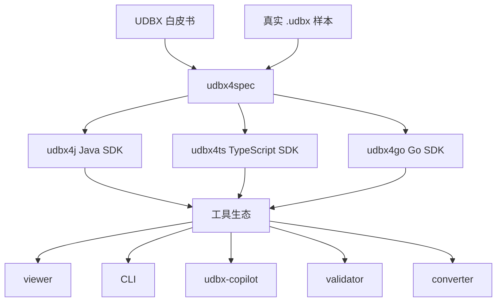
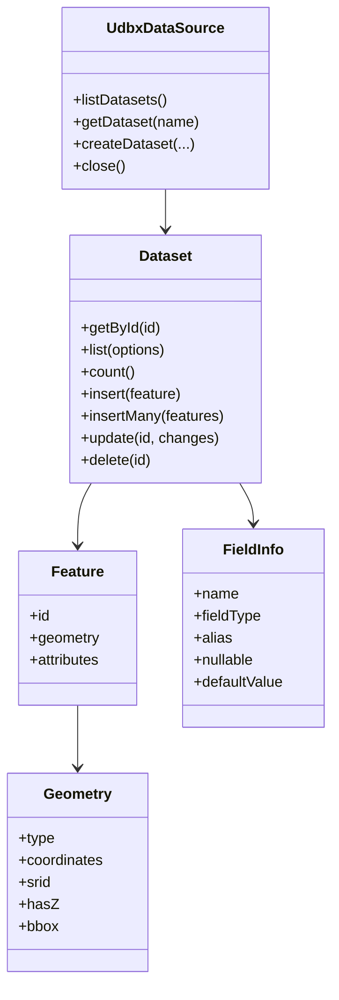

# 整体架构

本文档说明 `udbx4x` 工作区的整体架构、依赖方向、子项目边界和核心数据流。

## 架构目标

`udbx4x` 的架构目标是：用一个统一规范约束多个语言 SDK，再在 SDK 之上建设工具生态。

核心原则：

- `udbx4spec` 是跨语言规范和合规资产中心。
- `udbx4j`、`udbx4ts`、`udbx4go` 是并列 SDK 实现。
- viewer、CLI、Copilot、validator、converter 等工具必须依赖 SDK。
- 工具层不得复制 SQLite 系统表解析、GAIA 编解码、CAD 编解码或字段映射逻辑。

## 分层视图



## 权威来源

从格式事实到实现代码的优先级：

1. UDBX 白皮书。
2. 真实 `.udbx` 样本。
3. `udbx4spec` 文档、参考类型、JSON Schema、合规夹具。
4. 各语言 SDK 的合规测试。
5. 各语言 SDK 实现。
6. 工具层实现。

当白皮书、样本和 `udbx4spec` 出现冲突时，必须先在规范文档中记录解释，再修改代码。

## 子项目边界

### `udbx4spec`

职责：

- 定义跨语言概念。
- 定义 API 命名和语义。
- 定义 `DatasetKind`、`FieldType`、几何模型和错误分类。
- 维护 JSON Schema、TypeScript 参考定义和 Java 参考接口。
- 维护合规夹具、golden bytes 和跨语言读写矩阵。

不负责：

- 具体语言 SDK 的运行时实现。
- 发布 Maven、npm、Go module。
- 工具层业务逻辑。

### `udbx4j`

职责：

- Java 17 SDK。
- Maven Central 发布。
- JDBC / SQLite 访问。
- JTS 内部几何集成。
- GAIA、CAD、系统表、Dataset API 的 Java 实现。

边界：

- 可以使用 JTS 作为内部几何库。
- 对外交换语义必须与 `udbx4spec` 的 GeoJSON-like 模型一致。

### `udbx4ts`

职责：

- TypeScript SDK。
- npm 发布。
- 浏览器、Node.js、Electron 运行时。
- `core + runtime` 架构。

边界：

- `src/core/` 必须平台无关。
- 浏览器数据库操作必须在 Worker 内完成。
- Electron 使用 `better-sqlite3`，但不能污染核心层。

### `udbx4go`

职责：

- Go SDK。
- Go module tag 和 pkg.go.dev 发布。
- CLI、viewer、validator 等工具的 Go 侧基础库。

边界：

- 公开 API 应保持 Go 惯用法。
- 语义必须与 `udbx4spec` 一致。
- 当前已完成 Text / GeoText 最小合规闭环；对外仍应明确这不是全部真实世界 Text 兼容范围。

### 工具生态

职责：

- 面向用户提供检查、查看、转换、查询、验证等能力。
- 通过 SDK 使用 UDBX 能力。

边界：

- 不直接维护格式解析分支。
- 不绕过 SDK 读取系统表或解析 geometry blob。
- 如果工具需要缺失能力，应先补 SDK。

## 核心数据模型



## UDBX 文件结构

UDBX 文件是 SQLite 数据库，核心系统表包括：

| 表 | 作用 |
|---|---|
| `SmRegister` | 数据集注册信息，如名称、类型、SRID、对象数 |
| `SmFieldInfo` | 字段元信息，如名称、类型、别名、默认值 |
| `geometry_columns` | 空间列注册信息 |
| `SmDataSourceInfo` | 数据源级元信息 |

二进制格式原则：

- 字节序统一为 Little-Endian。
- Point/Line/Region 使用 GAIA Geometry。
- CAD 使用 SuperMap GeoHeader / CAD 二进制格式。
- SuperMap String 使用 `int32(byteLength) + UTF-8 bytes`。

## 依赖方向

允许的依赖方向：

```text
白皮书 / 样本 -> udbx4spec -> SDK -> tools
```

禁止的依赖方向：

```text
tools -> 复制 SDK 内部解析逻辑
SDK -> 依赖工具层
udbx4spec -> 依赖具体 SDK 实现
```

## 变更流

公开概念或格式行为变化的标准流程：

1. 修改 `udbx4spec`。
2. 增加或更新合规夹具。
3. 更新相关 SDK。
4. 更新跨语言一致性测试。
5. 更新工具层。
6. 更新用户文档和发布说明。
